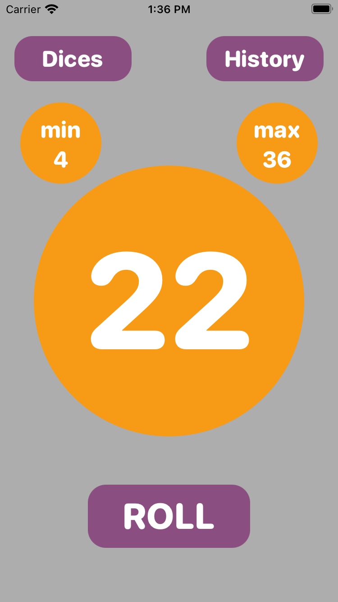

# AnyDice

A project application for the "Programmerare iPhone och Android" course.

AppStore link: https://apps.apple.com/us/app/anydice/id1540270825

**AnyDice is a simple and lightweight app that allows to roll any number of dices with up to 50 faces and keep track of the rolls results.**

